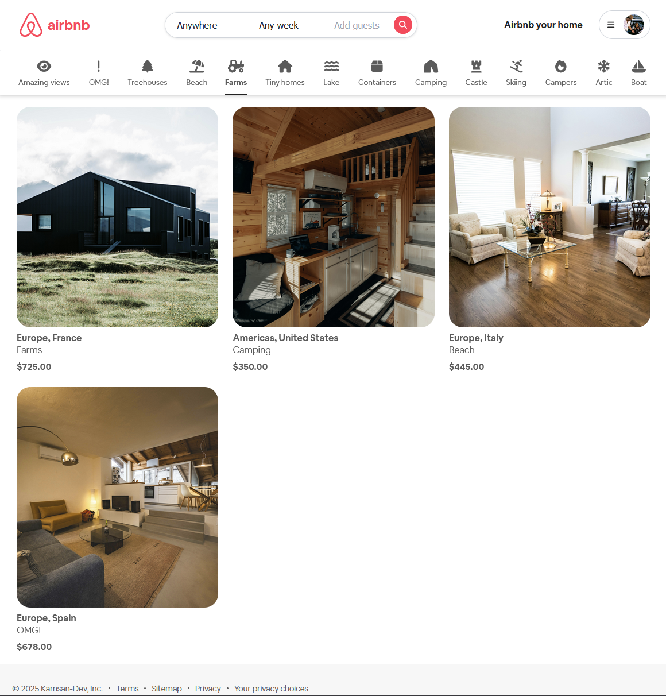
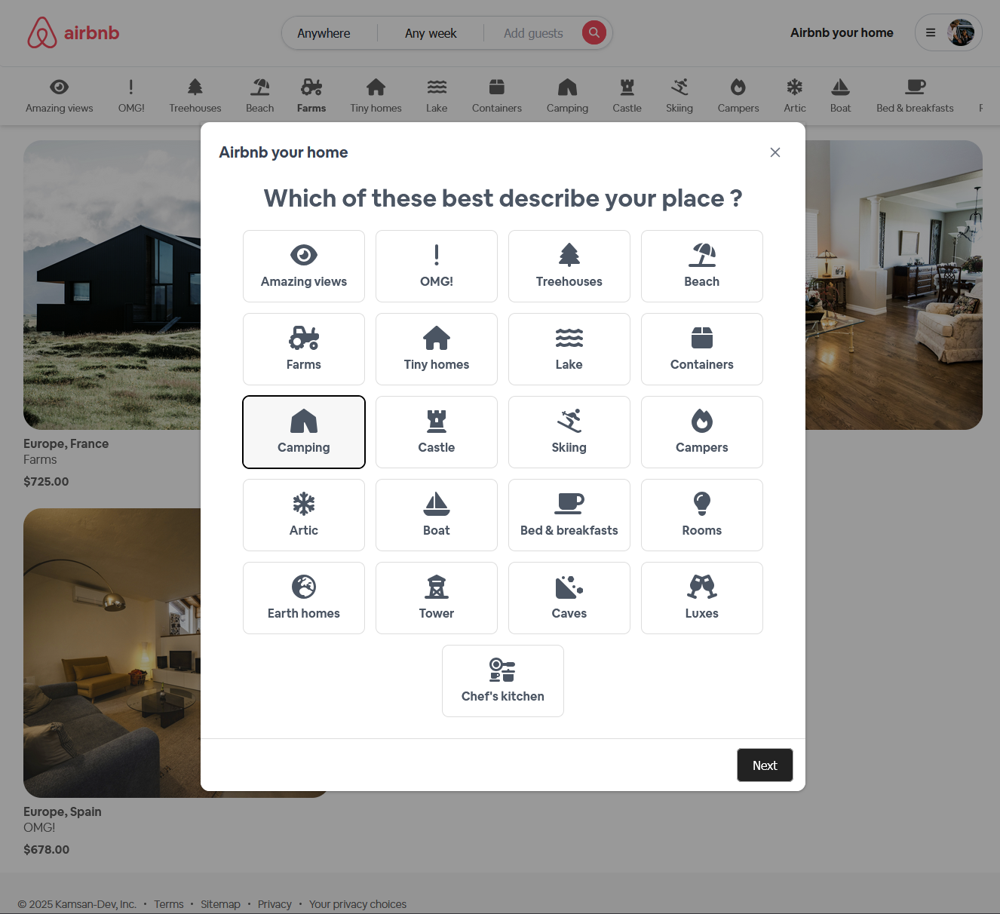
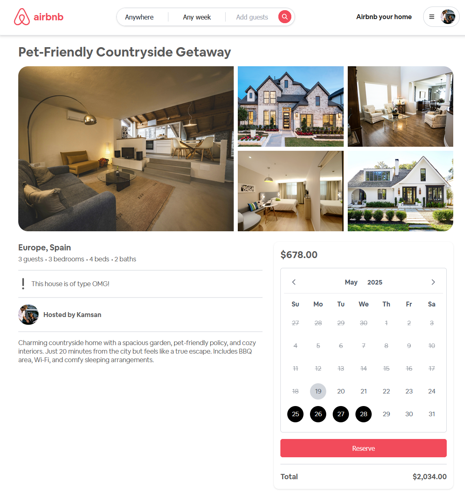
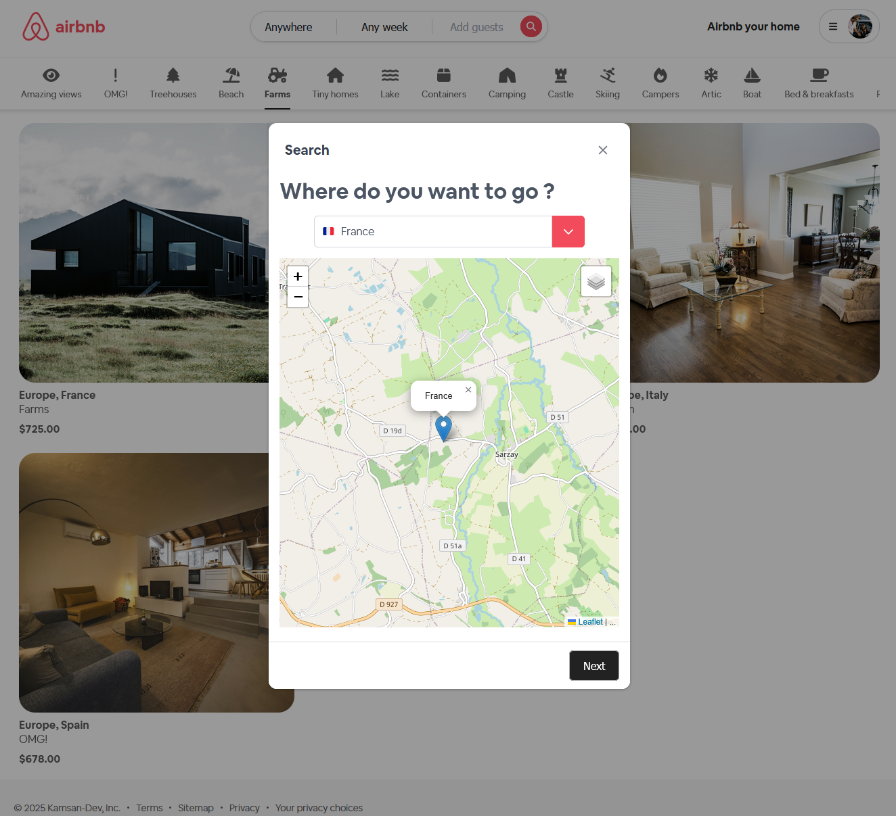

# Airbnb clone application

Web application : https://airbnb-clone-kamsan.duckdns.org
⚠️ _Note: The demo might be down occasionally depending on server availability._

### Key Features:

- 📅 Booking management for travelers
- 🏠 Landlord reservation management
- 🔍 Search for houses by criteria (location, date, guests, beds, etc)
- 🔐 Authentication and Authorization (Role management) with Auth0 (OAuth2)
- 🏢 Domain-driven design

## 🛠️ Tech Stack

- Framework: Angular 17

- Server : Spring Boot 3.3

- UI Library: PrimeNG 17

- CSS Framework: Tailwind CSS

- Database : PostgresSQL

- API Communication: RESTful API integration

## 💻 UI Preview

#### Home

    

#### Register a new listing

    

#### Landlord properties

    

#### Book a listing

    

#### Search by criteria

    

